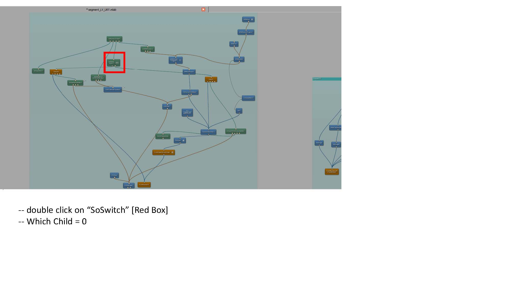
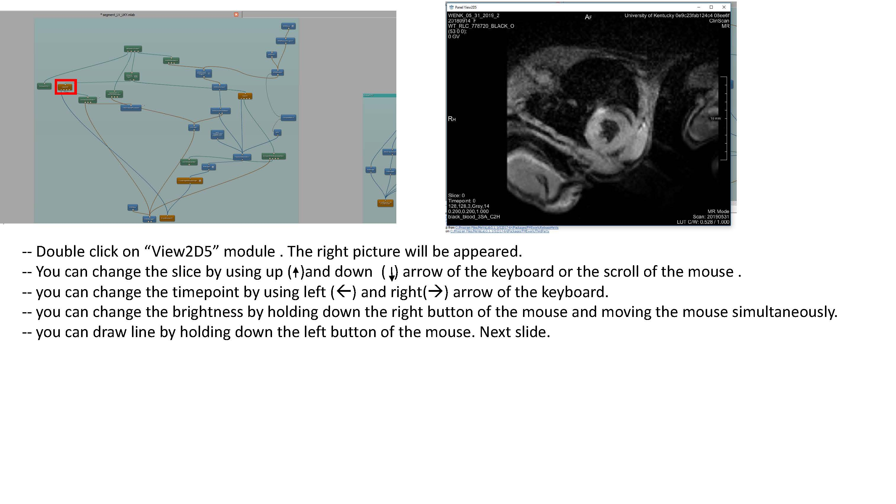
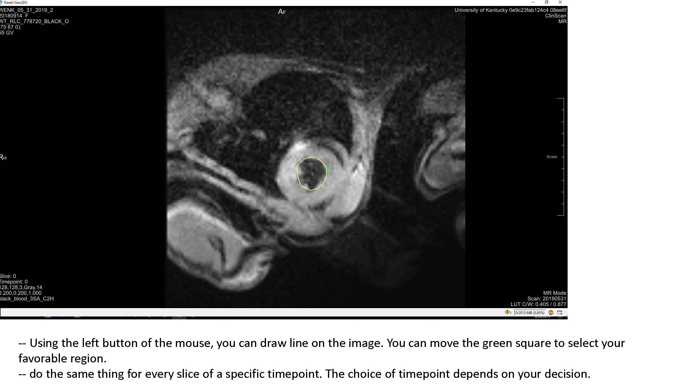
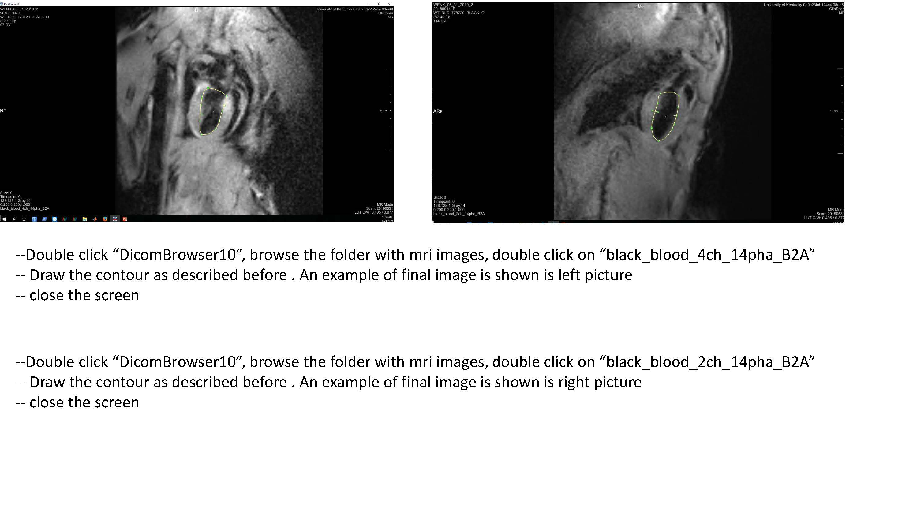
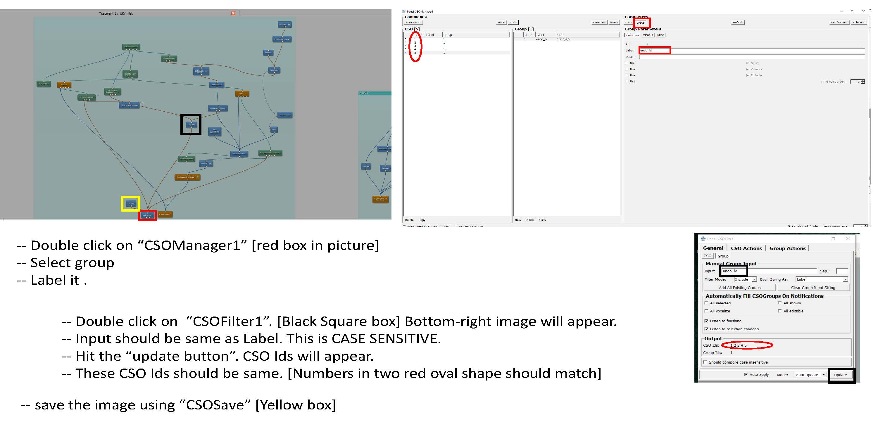
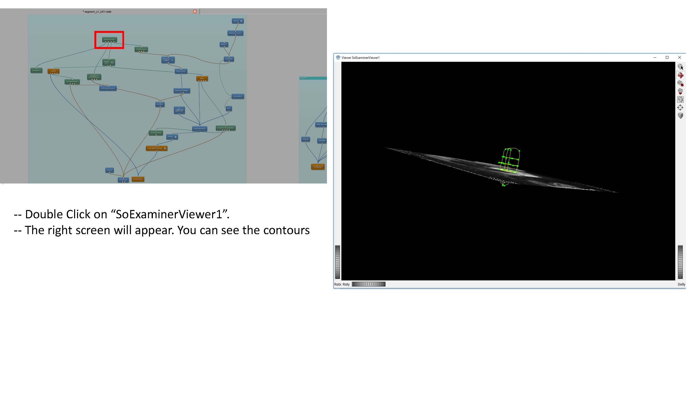
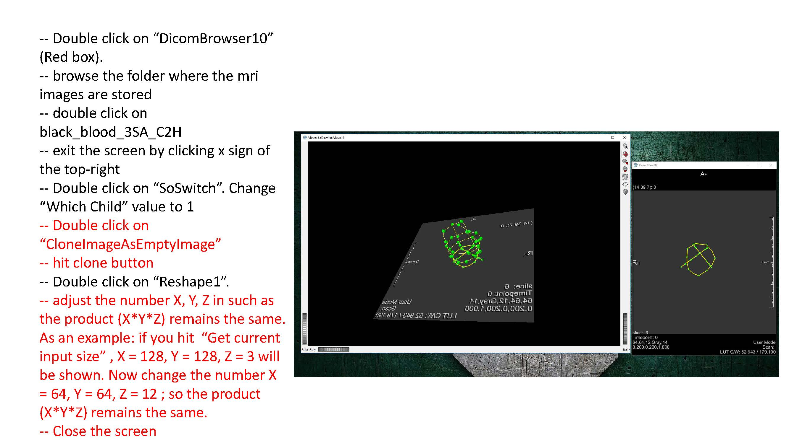
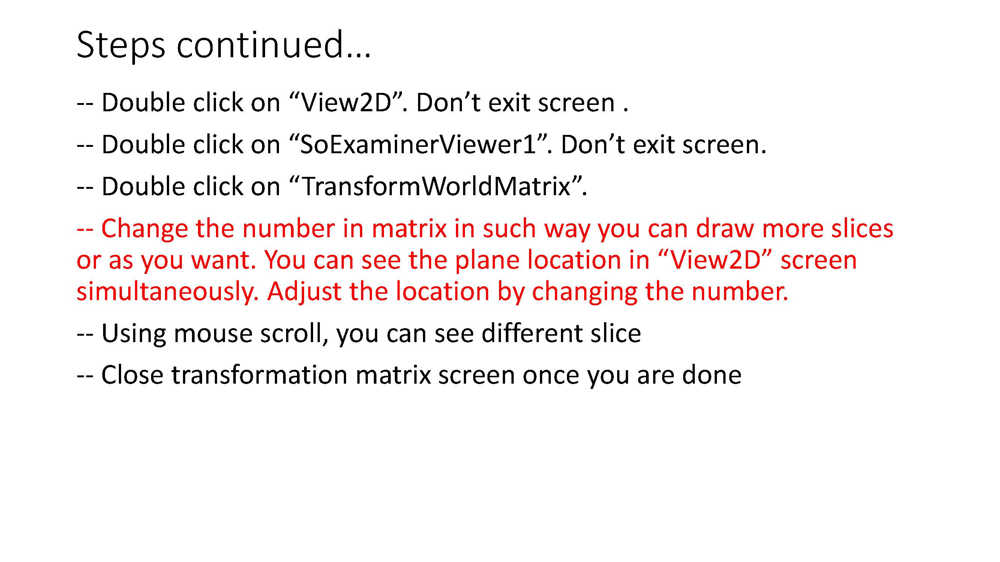
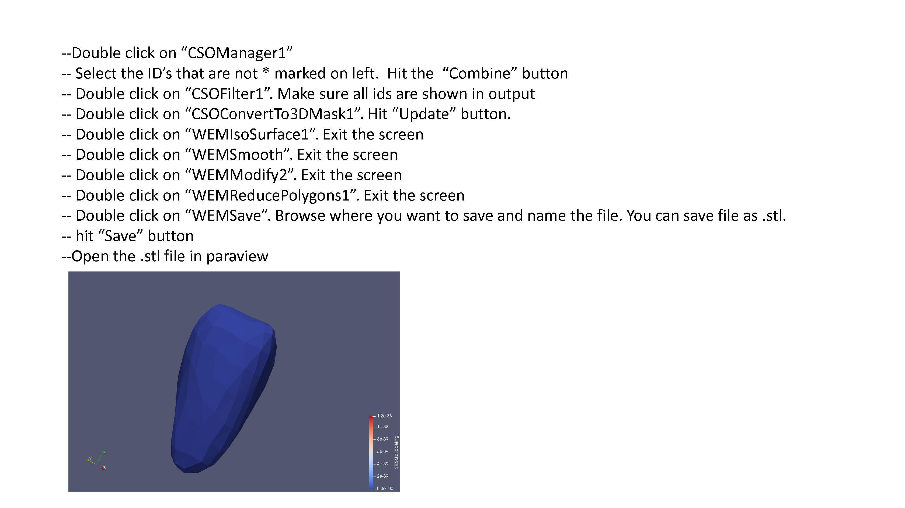
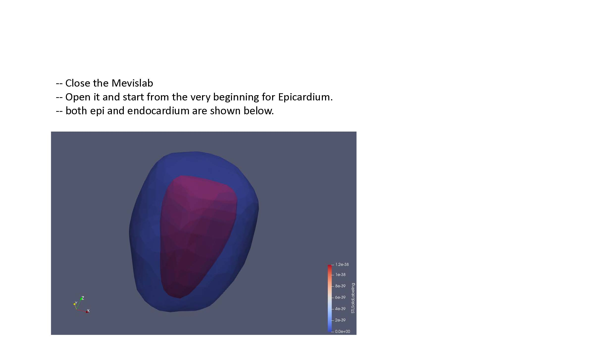

<div class="notice--info">
  <h4>Message</h4>
  <p>This page is under  construction.</p>
</div>

One of the strengths of the finite element method is the ability to solve problems over complex geometries. Given cardiac MRI (CMR) data, ventricle specific meshes can be generated.

First, download [MeVisLab](https://www.mevislab.de/download/) version >= 3.1.1. Any previous version will be lacking required modules. Additionally, the following files are required from the MMotH-Fenics-UK repository and can be found in the [mesh_generation](https://github.com/mmoth-kurtis/MMotH-Fenics-UK/tree/master/mesh_generation) subdirectory:  
  * 1.createLV.py  
  * LV_Test.py  
  * LV_Segmentation_UKY.mlab  

Open MeVisLab and load "LV_Segmentation_UKY.mlab". The following screen should appear:

  

Go ahead and exit out of the "Panel WEMSave" box if it appears. MeVisLab saves the last current state of the file previous to closing. Since the WEMSave module is the last to be called before exiting, this module appears upon opening.  

First, we need to convert the raw CMR data to the DICOM format:  

  * Double click the DicomImport module to open it. Navigate to the directory containing the raw CMR images.
  * Specify the folder to save the converted images in the "Target Path" dialogue box.
  * Click "Import". A window should open as the images are converted, and upon finishing will display the text "Finished, exit status 0".

Follow the remaining instructions set out in FEniCS_LV_Segmentation.pdf (currently shown as a sequence of .jpg files here until formatting can be improved). This should yield a .stl file defining the endocardium surface. The steps should be repeated to also create an epicardium surface.

**Note, for rat meshes, instead of using black_blood_3SA_C2h images for the short axis, use "Dense_newFS_6SA_AveMag_Slc0" for the short axis slices, and "Dense_newFS_2LA_AveMag_Slc0" & "Dense_newFS_2LA_AveMag_Slc1" for the long axis images.**

  

  

  

  

  

  

  

  

  


* Some clarification for the Transform World Matrix: Change the entries in the last column so that the contours are in the center of the viewing volume. **Make sure to use the same transformation for both endo and epi volumes.**  

   

   

  

  


* Run the 1.createLV.py script on the stl files (creating json input for this now to be able to specify output directory and mesh name). This creates .vtk files.
  * Note: in the 1.createLV.py file, line 51, the user can control mesh refinement  
    ```python
    vtk_py.createLVmesh(filename, 0.5, "clipped_epi_tmp.stl", "clipped_endo_tmp.stl")
    ```
    The `0.5` is the mesh size. The smaller this number, the more refined the mesh is. 0.5 is the default.

* Run LV_Test.py on the New_Mesh files to yield the HDF5 file. This is what is needed for FEniCS. This step creates the mesh and assigns fiber angles, as well as the local coordinate system for each element.
* Crop the top of the volumes out in Paraview.
* Quick note: **Check the fiber orientation**. Loading in the ```fiber.pvd``` file will show scalar values for fiber angles at each integration point. This may not actually be correct. After initializing a simulation, the ```fiber000000.vtu``` file will allow for the visualization of the fiber angle vectors in Paraview. Load this file, and click "Glyph". In my case, after the epicardium, the fibers wound the wrong way. I had to switch ```isendoflip``` to ```False``` in line 51 of ```LV_Test.py```.

<a href="../creating_input_files/fenics_input_readme.html" class="btn btn--primary"><< Creating Input Files </a>
